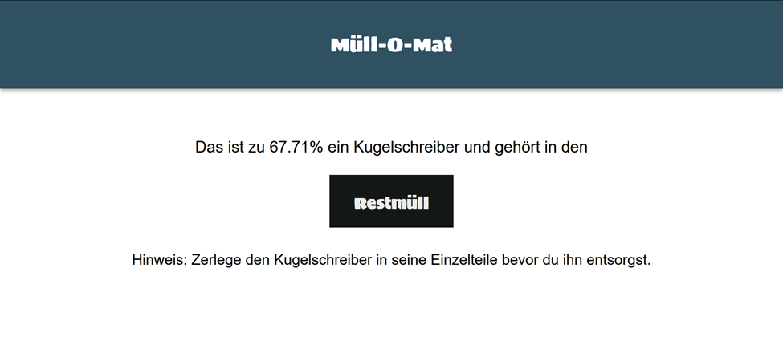
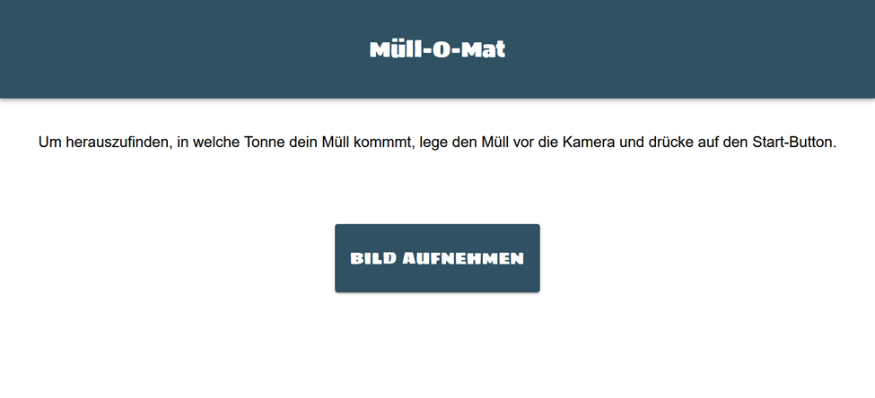
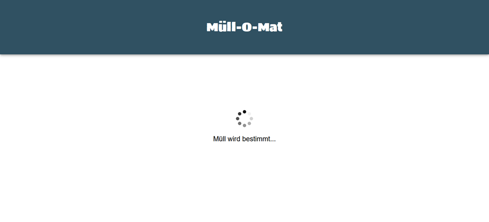
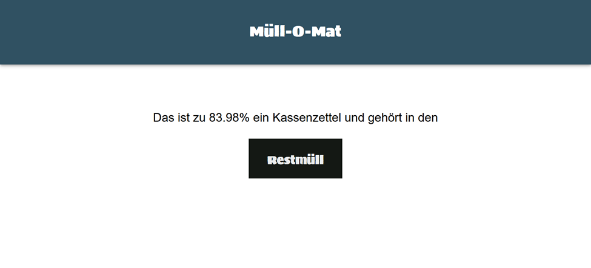
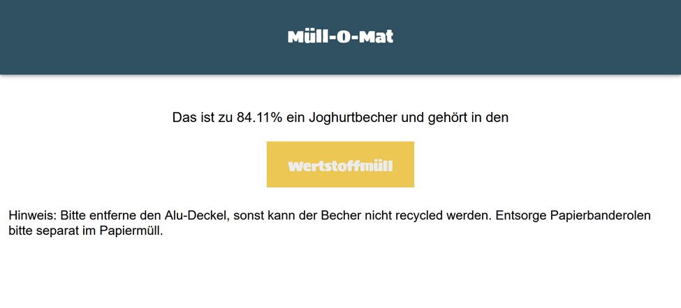

# Müll-O-Mat
Welcome to the Müll-O-Mat! This project is a TinyML-based web application that helps sorting waste in public spaces. It focuses on classifying waste through image classification and providing information on how to sort the waste correctly, specifically targeting types of waste that are typically encountered in public areas such as universities, which are often challenging to sort correctly.




You can take a picture of your waste and the application will tell you how to sort it. The application is based on a machine learning model that was trained in Edge Impulse and deployed on an Arduino Portenta H7 board with the Arduino Portenta Vision Shield.

Due to time and resource constraints, the model is currently only able to classify the following waste categories:
- Yoghurt cups
- Reciepts
- Ball pens

The user interface of the application is built with the Ionic framework and the communication between the web application and the Arduino Portenta H7 board is done via a Websocket server. Using Ionic allows the application to be run on multiple platforms, such as Android, iOS, and the web.

As waste sorting is not only a local but also a global issue, and the waste sorting rules differ from region to region, the application is designed to be easily adaptable to different waste categories so that classified items can be sorted correctly according to the local waste sorting rules.

## Table of Contents
- [Hardware](#hardware)
- [Model Training](#model-training)
- [Prerequisites](#prerequisites)
- [Getting Started](#getting-started)
- [Adapt Trash Categories](#adapt-trash-categories)
- [Usage](#usage)
- [License](#license)


## Hardware
The project uses the following hardware components:
- Arduino Portenta H7
- Arduino Portenta Vision Shield with HM-10B0 Camera Module

## Model Training
To better understand the used model and therefore how the Müll-O-Mat works, this section provides an overview of the model training process.

The model was trained on a dataset of 402 images, which were collected by the project team as well as collected from the internet:
- yoghurt cups (source: self-collected)
- reciepts (source: self-collected)
- ball pens (source: self-collected and [Roboflow Universe](https://universe.roboflow.com/mohammed-fuhvg/boya-tanimi))


The model was trained based on a dataset that was split into 80% training data and 20% test data. Thus, the model was trained on the following images:

- 80 yoghurt cup images
- 115 reciept images
- 127 ball pen images

The model was trained utilizing the Edge Impulse platform. During the training process, the images underwent the following processing steps:
- The image resolution was adjusted to 96x96 pixels.
- The color mode was set to Grayscale.

Following parameters were used for the training process:
- Training epochs: 100
- Learning rate: 0.0005
- Data augmentation applied
- Validation split: 0.2

The model was trained using a MobileNetV1 architecture, configured with an alpha of 0.2, without a final dense layer, and a dropout rate of 0.1.

The model was initialized with the weights of an already pretrained Image Classification model provided by Edge Impulse.

Based on the validation data, the model achieved an accuracy of 0.90 and a loss of 0.19. The test data was used to evaluate the model's performance and the model achieved an accuracy of 0.9577.

The model was converted with the EON compiler to optimize the model for the Arduino Portenta H7 board. It quantized the model to 8-bit integers. The firmware was then build for the Arduino Portenta H7 board and deployed on the board.

## Prerequisites
### Hardware
To install the application, you need to have the following hardware components:
- Arduino Portenta H7
- Arduino Portenta Vision Shield with HM-10B0 Camera Module

On the Arduino Portenta H7 board, you need to have the trained model deployed. You can find the firmware with the trained model in the [firmware](./firmware) folder of this repository. To deploy the firmware, you need to connect the Arduino Portenta H7 board to your computer and upload the firmware with the correct script for your operating system.

### Software
To run the web application, you need to have the following software components:
- Node.js: Required for npm commands and project setup. You can download it from the official Node.js website.
- npm: Node.js package manager. It is installed automatically with Node.js. You can check the version of npm by running npm -v in the terminal or command prompt.
- Ionic CLI: The command-line interface for Ionic, used to create, build, test, and deploy Ionic apps. After installing Node.js and npm, install the Ionic CLI globally with `npm install -g @ionic/cli`.

A Websocket server is required to communicate with the Arduino Portenta H7 board. You need to have Python installed on your computer to run the Websocket server. You can download Python from the official Python website. 

## Getting Started
1. Clone the repository to your local machine.
```
git clone https://github.com/ahirsch-github/muell-o-mat.git
```

2. Install the required dependencies.
```
npm install
```

3. Connect the Arduino Portenta H7 board with the loaded firmware to your computer.

4. Start the Websocket server.
```
python websocket_server.py
```

5. Start the Web application.
```
ionic serve
```
## Adapt Trash Categories
In some cases, you might want to adapt the trash categories that the waste items belong to. Some things even differ from region to region. To adapt the trash categories, you need to change the following file:
- `src/app/enums/trash-categories.ts`:
For example, if you want to add a new class called "Tetra Pak", you need to add the following line to the file:
```typescript
export const trashCategories = {
    plastic: {
        plastic: "Plastic",
        yoghurt: "Yoghurt Cup",
        tetraPak: "Tetra Pak",
    },
};
```
Similarly, you can add new classes to the other categories or change which category a class belongs to.

## Usage
After starting the application, you will see the home screen of the application. Hold your waste item in front of the camera and click on the "Bild aufnehmen" button to start the image classification. 



As soon as the button is clicked, the model will classify the waste item while showing a loading spinner. The classification process takes a few seconds, because the application waits for 
3 classification results. The application then aggregates the classification results and selects the class which has the most often highest confidence score. This is done to avoid outliers, which can occur, for example, if the object was not held correctly in front of the camera at the beginning of the classification and thus affects the result.



After the classification is done, the application will show the classification result with its confidence score. The confidence score is the average of the confidence scores of the 3 classification results of the classified waste item. 
Additionally, the user can see the corresponding waste category via text and color (yellow: plastic, blue: paper, black: general waste).



If the predicted class has corresponding additional information, the information will be shown below the classification result.




## License
This project is licensed under the MIT License - see the [LICENSE](LICENSE) file for details.